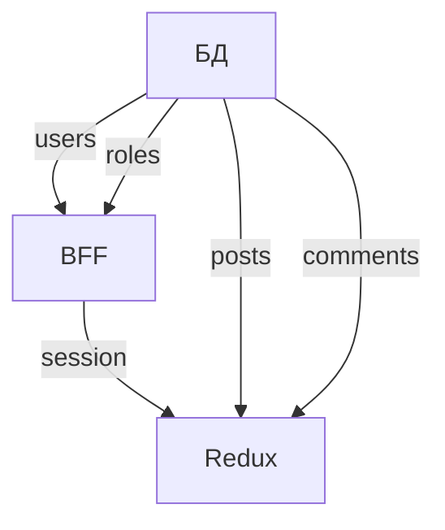

# 📚 Авторский Блог
_React-приложение с системой ролей и управлением контентом_

---

## 🚀 Быстрый старт

```bash
# Установка зависимостей
npm install

# Запуск development-сервера
npm start

# Запуск JSON Server (в отдельном терминале)
npx json-server --watch src/db.json --port 3005
```

---

## 🧩 Технологический стек

| Категория       | Технологии                          |
|----------------|-------------------------------------|
| **Frontend**   | React, React Router                 |
| **State**      | Redux + Redux Thunk                 |
| **Стили**      | Styled Components                   |
| **Формы**      | React Hook Form + Yup               |
| **API**        | JSON Server + BFF слой              |

---

## 🗃️ Архитектура данных

### 🗂️ Сущности и хранилища


### 🧾 Схемы данных
**Таблицы БД:**
```javascript
// users
{ id, login, password, registered_at, role_id }

// roles
{ id, name }

// posts
{ id, title, image_url, content, published_at }

// comments
{ id, author_id, post_id, content, published_at }
```

**Состояния:**
```javascript
// BFF
{ 
  session: { login, password, role } 
}

// Redux
{
  user: { id, login, roleId },
  posts: [...],
  currentPost: {
    ...post,
    comments: [...]
  }
}
```

---

## ✨ Ключевые возможности

### 🔐 Система доступа
- 4 уровня ролей
- Защищенные маршруты
- Динамический UI

### 📝 Управление контентом
| Функция       | Доступ            |
|--------------|-------------------|
| Создание     | Админ             |
| Редактирование | Админ, Модератор|
| Комментирование | Читатель+      |

---

## 🎨 Интерфейс

```plaintext
HEADER
├─ Лого + описание
├─ Навигация (по ролям)
└─ Кнопки авторизации

MAIN
├─ Главная: карточки статей
├─ Статья: полный текст + комментарии
└─ Админка: управление пользователями

FOOTER
├─ Копирайт
└─ Виджет погоды (Яндекс)
```

---

## 🛡 Защита и ошибки

```javascript
<PrivateContent 
  access={[ROLE.ADMIN]} 
  serverError={error}
>
  <AdminPage />
</PrivateContent>
```

---

## 📌 Дополнительно

- Валидация форм
- Модальные окна подтверждения
- Быстрый поиск (debounce 2с)
- Адаптивная пагинация

```
Happy coding! 🎉
```
